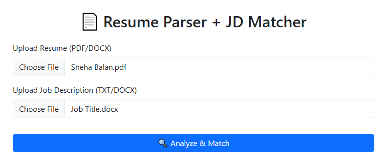
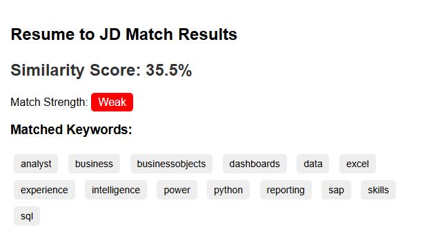

# 📄 Resume to JD Matcher AI

A simple AI-powered Flask web application that helps job seekers analyze how well their resume matches a given Job Description (JD). It extracts relevant keywords from both documents and returns a similarity score along with matched terms.

---

## 🔍 Features

- ✅ Upload a resume and a JD (PDF)
- 🧠 Extract text using PyMuPDF
- 🧾 Match resume content with JD using keyword-based NLP
- 📊 Calculate similarity score (%)
- 🟢 Visual feedback on match strength
- 🌐 Flask web app interface with styled HTML output

---

## 🚀 Demo Screenshot & Link

 

> _Upload resume + JD → Get similarity score and keywords!_

Check out the live app here: [Resume Parser AI on Render](https://resume-parser-ai-2spd.onrender.com)
---

## 🛠️ Tech Stack

- Python 3.11+
- Flask
- PyMuPDF (fitz)
- Scikit-learn (for TfidfVectorizer, if used)
- HTML, CSS (basic styling)

---

## 📂 Project Structure
```
resume-jd-matcher-ai/
│
├── app.py # Flask app entry point
├── Procfile.py # Render deployment file
├── render.yaml # Render build configuration
├── requirements.txt # Python dependencies
├── README.md # This file
│
├── parser/ # Core parsing & matching logic
│ ├── init.py
│ ├── extract_text.py # Extracts text from PDFs
│ ├── jd_matcher.py # JD vs Resume matching logic
│ ├── parse_entities.py # Extracts entities like skills, tools
│ ├── parse_sections.py # Parses resume sections (e.g., Experience)
│
├── utils/ # Helper utilities
│ ├── clean_text.py # Text cleaning & normalization
│ ├── export.py # Export match result to CSV
│
├── templates/ # HTML templates for Flask
│ ├── index.html
│ └── results.html

```
---

## 🖥️ How to Run Locally

### Step 1: Clone the Repo
```
bash
git clone https://github.com/your-username/resume-jd-matcher-ai.git
cd resume-jd-matcher-ai
```
### Step 2: Create Virtual Environment
```
python -m venv venv
source venv/bin/activate      # On Windows: venv\Scripts\activate
```
###  Step 3: Install Dependencies
```pip install -r requirements.txt```

### Step 4: Run the Application
```python app.py```

Visit http://127.0.0.1:5000 in your browser.

---

### 📤 Deployment on Render
Push the project to GitHub.

Go to https://render.com and create a new web service.

Connect your GitHub repo.

Render will use render.yaml and Procfile.py to build and run the app.

---

### 📈 Example Output
Similarity Score: 35.5%

Match Strength: Weak

Matched Keywords:

analyst, business, businessobjects, dashboards, data,
excel, experience, intelligence, power, python,
reporting, sap, skills, sql

---

### 🧠 Tech Stack
Flask – Web framework
PyMuPDF – PDF text extraction
scikit-learn – Text similarity and vectorization
NLTK – Stopword removal and token processing

---

### ✅ Use Cases
Job seekers matching resumes to job descriptions
Recruiters screening applicant resumes
Freelancers offering resume optimization tools

---

### 🔮 Future Improvements
TF-IDF or transformer-based semantic similarity
Highlight missing critical keywords
Resume recommendations based on JD
Support for DOCX files

---

### 👩‍💻 Author
Sneha Balan
Business Intelligence Analyst
LinkedIn | GitHub

---

### 📜 License
This project is licensed under the MIT License. Feel free to use, fork, and modify it.

---
